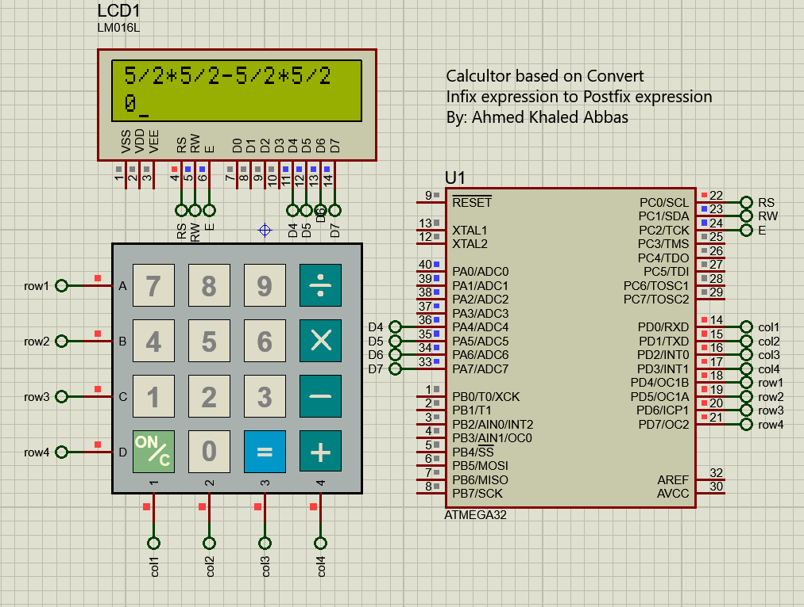

# Calculator

This project involves the design of both software and hardware to perform basic arithmetic calculations in an embedded system.

## Hardware Components
- Atmega32
- LCD
- Keypad

## Challenges

- Perform multiple arithmetic operations by following the order of precedence for each operation.
- Manage floating-point calculations due to Atmega32's lack of an FPU.
- Support multi-digit numbers.
- Detect invalid operations
- Manage negative numbers.

## Hardware Connection

## Author
Linkedin: [Ahmed Khaled](https://www.linkedin.com/in/eng-ahmedkhaled/)
